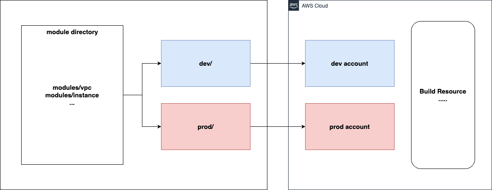

# Terraform module 화
Terraform 코드를 모듈화 하여, dev , prod 계층별로 같은 모듈을 공유함.

이를 통해 재사용성을 확보할 수 있으며, 

tf.state 파일을 따로 관리하게 되기 때문에, dev 계의 state가 변화하더라도 , prod에는 영향이 가지 않아 테스트하거나 인프라 확장 등에 용이함.

## Architecture

위의 아키텍처를 따름

기본적인 의의는 dev와 prod별로 state를 따로 관리하고 , terraform resource를 모듈화하여 인프라 코드의 재 사용성을 늘리는것에 있음.

기본적으로 dev , prod 영역을 관리하는 AWS Iam user를 생성함.

그리고 dev,prod 별로 다른 폴더를 생성한 뒤, module를 각기 따로 import 함.

이때 dev와 prod가 사용중인 iam user의 access key와 secret access key가 다르기 때문에, state는 각자 생성됨.

또한 module 내부 리소스의 코드에서도, env 변수가 prod일 경우와 dev일 경우를 따로 작성해서, 각기 다른 타입의 리소스가 생성되거나, 다른 포트를 열거나 하는 분기를 생성해줌.